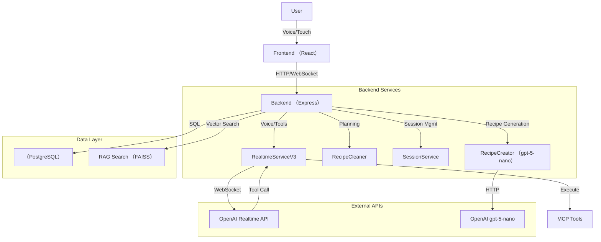

# Yorijori Architecture （V3）

**Version**: 3.0
**Status**: Production Ready
**Last Updated**: 2025-11-23

---

## 🏗️ System Architecture

요리조리（Yorijori） V3는 **Express Backend**와 **OpenAI Realtime API**를 중심으로 한 실시간 음성 요리 가이드 시스템입니다.

### 주요 특징
- **Express-only Architecture**: Django 등 Legacy 서버 제거, 단일 Node.js 서버로 통합
- **Native Tool Calling**: LangChain 없이 OpenAI Realtime API가 직접 도구 호출
- **RAG Search**: FAISS 기반의 의미론적 레시피 검색
- **Pre-Planning**: `gpt-5-nano`를 이용한 사전 레시피 구조화 （0.1초 세션 시작）

---

## 🔄 System Flow

### 1. 레시피 데이터 파이프라인
1. **Import**: Raw JSON 데이터 로드 （`npm run import`）
2. **Planning**: `gpt-5-nano`가 레시피를 구조화하여 `cleaned_recipes` 테이블에 저장 （`npm run clean:all`）
3. **Indexing**: RAG 검색을 위한 FAISS 인덱스 생성

### 2. 음성 요리 가이드 흐름
1. **세션 시작**: 사용자가 "요리 시작" 클릭 → `cleaned_recipes`에서 데이터 로드 （0.1초）
2. **WebSocket 연결**: Frontend ↔ Backend ↔ OpenAI Realtime API 연결
3. **음성 인식**: 사용자 음성 → OpenAI （STT）
4. **의도 파악 & 도구 실행**:
   - OpenAI가 `navigate_next_step` 등의 도구 호출 결정
   - Backend가 MCP Tool 실행
   - 결과가 Frontend로 전송되어 UI 업데이트
5. **음성 응답**: OpenAI가 실행 결과를 바탕으로 음성 응답 생성 （TTS）

---

## 📦 Components

### Backend （`backend/src/`）
- **`serverV3.ts`**: 메인 엔트리포인트, WebSocket 서버 설정
- **`services/realtimeServiceV3.ts`**: OpenAI Realtime API 연동 및 도구 실행 관리
- **`services/recipeCreator.ts`**: `gpt-5-nano`를 이용한 레시피 생성 및 추천
- **`services/recipeCleaner.ts`**: 레시피 정제 및 Planning 결과 관리
- **`mcp/mcp-client.ts`**: MCP （Model Context Protocol） 도구 관리자

### Frontend （`frontend2/src/`）
- **`pages/CookingMode.tsx`**: 요리 진행 메인 화면
- **`components/CookingUI/VoiceInteraction.tsx`**: 음성 대화 UI 및 VAD 시각화
- **`hooks/useWebSocket.ts`**: 실시간 통신 관리

---

## 📊 Database Schema

### `recipes` （원본 데이터）
- `recipe_id`: PK
- `title`: 레시피 제목
- `raw_data`: JSONB （원본 전체 데이터）

### `cleaned_recipes` （Planning 결과）
- `id`: PK
- `recipe_id`: FK
- `planning_result`: JSONB （구조화된 단계, 재료, 도구 정보）
- `opening_remark`: 시작 멘트
- `closing_remark`: 종료 멘트

### `cooking_sessions` （세션 정보）
- `session_id`: PK
- `current_step_index`: 현재 진행 단계
- `status`: 세션 상태 （active, completed）

---

## 🔧 MCP Tools （Available Tools）

| Tool Name | Description |
|-----------|-------------|
| `navigate_next_step` | 다음 요리 단계로 이동 |
| `navigate_previous_step` | 이전 요리 단계로 이동 |
| `navigate_to_step` | 특정 단계로 이동 |
| `start_timer` | 타이머 시작 |
| `stop_timer` | 타이머 정지 |
| `get_current_step` | 현재 단계 정보 조회 |
| `get_recipe_info` | 레시피 전체 정보 조회 |

---

## 📡 API & Events

### HTTP API
- `POST /api/cooking/v3/start`: 세션 시작
- `GET /api/recipes/search/rag`: RAG 검색
- `POST /api/recipes/generate`: AI 레시피 생성

### WebSocket Events
- `user_transcription`: 사용자 음성 텍스트
- `tool_executed`: 도구 실행 결과 （UI 업데이트 트리거）
- `timer_state_update`: 타이머 상태 동기화
