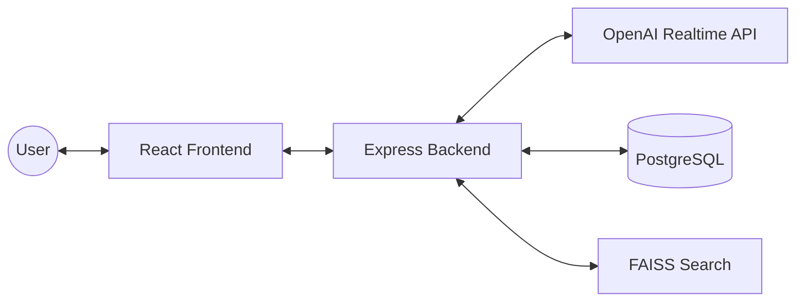

# 🍳 요리조리 (Yorijori) V3

**AI 음성 요리 가이드 시스템**

> **"말 한마디로 시작하는 스마트한 요리 생활"**
>
> gpt-5-nano와 OpenAI Realtime API를 활용하여, 복잡한 레시피를 실시간 음성 대화로 안내해주는 지능형 요리 어시스턴트입니다.

---

## ✨ 주요 기능

- **🗣️ 실시간 음성 대화**: "다음 단계로 가줘", "타이머 5분 맞춰줘" 등 자연어로 요리 제어
- **⚡ 0.1초 즉시 시작**: 사전 Planning 기술로 대기 시간 없이 바로 요리 시작
- **🤖 AI 레시피 생성**: 없는 레시피도 `gpt-5-nano`가 즉석에서 생성 및 구조화
- **🔍 의미 기반 검색 (RAG)**: "매콤한 국물 요리"처럼 개떡같이 말해도 찰떡같이 검색
- **⏱️ 스마트 타이머**: 요리 단계와 연동된 타이머 자동 설정 및 알림

---

## 🏗️ 시스템 아키텍처 (V3)

단일 **Express Backend**와 **OpenAI Realtime API**의 강력한 통합으로 심플하고 빠른 구조를 완성했습니다.

자세한 기술 구조는 [ARCHITECTURE.md](ARCHITECTURE.md)를 참고하세요.

---

## 🚀 시작하기

### 개발자 가이드
프로젝트 설치, 실행, 트러블슈팅에 대한 상세한 내용은 아래 가이드를 확인하세요.

👉 **[DEVELOPER_GUIDE.md](DEVELOPER_GUIDE.md)**

### 기술 스택
- **Frontend**: React, TypeScript, Vite, WebSocket
- **Backend**: Node.js, Express, TypeScript
- **AI**: OpenAI Realtime API (Voice), gpt-5-nano (Reasoning)
- **Database**: PostgreSQL, FAISS (Vector DB)

---

## 👥 팀

- **개발**: [Your Name]
- **문의**: [Your Email]

---

## 📄 라이선스

MIT License
