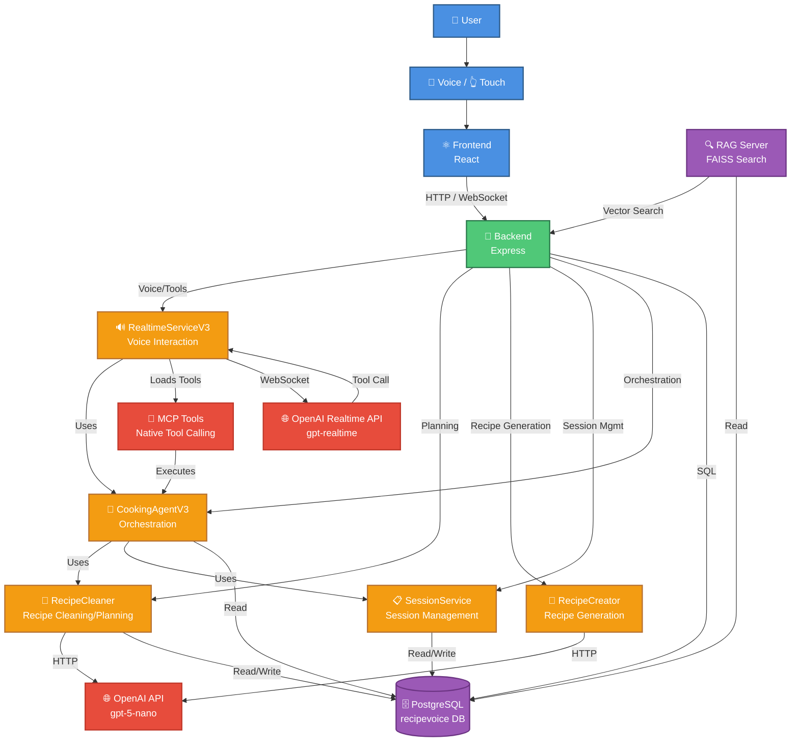

# RecipeVoice 아키텍처 다이어그램

## 시스템 아키텍처



## 주요 컴포넌트 설명

### User Layer (사용자 계층)
- **User**: 최종 사용자
- **Voice/Touch**: 음성 및 터치 입력
- **Frontend (React)**: React 기반 프론트엔드 UI

### Backend Layer (백엔드 계층)
- **Backend (Express)**: Express.js 기반 백엔드 서버

### Service Layer (서비스 계층)
- **RealtimeServiceV3**: 실시간 음성 상호작용 처리 (gpt-realtime 사용)
- **RecipeCleaner**: 레시피 클리닝 및 Planning (gpt-5-nano 사용)
- **RecipeCreator**: AI 레시피 생성 (gpt-5-nano 사용)
- **SessionService**: 세션 관리 (DB CRUD)
- **CookingAgentV3**: 요리 세션 오케스트레이션

### Data Layer (데이터 계층)
- **PostgreSQL**: 메인 데이터베이스 (recipevoice)
  - `recipes`: 원본 레시피 데이터
  - `cleaned_recipes`: 정제된 레시피 데이터
  - `cleaned_steps`: 정제된 조리 단계
  - `cooking_sessions`: 요리 세션
  - `session_states`: 세션 상태 로그
- **RAG Server (FAISS)**: 의미 기반 레시피 검색

### External APIs (외부 API)
- **OpenAI Realtime API (gpt-realtime)**: 실시간 음성 대화
- **OpenAI API (gpt-5-nano)**: 레시피 생성 및 정제
- **MCP Tools**: Native Tool Calling (navigate_next_step, start_timer 등)

## 데이터 흐름

### 1. 레시피 클리닝 (사전 처리)
```
Raw Recipe → RecipeCleaner → gpt-5-nano → cleaned_recipes 테이블
```

### 2. 레시피 검색
```
User Query → Backend → RAG Server (FAISS) → PostgreSQL → Results
```

### 3. 세션 시작
```
Recipe ID → CookingAgentV3 → RecipeCleaner (데이터 로드)
         → SessionService (세션 생성) → PostgreSQL
```

### 4. 음성 상호작용
```
User Voice → Frontend → Backend → RealtimeServiceV3
         → OpenAI Realtime API (gpt-realtime)
         → Tool Call → MCP Tools → CookingAgentV3
         → SessionService (상태 업데이트) → PostgreSQL
```

## 모델별 역할

| 모델 | 용도 | 호출 서비스 |
|------|------|------------|
| **gpt-5-nano** | 레시피 클리닝/정제 | RecipeCleaner |
| **gpt-5-nano** | AI 레시피 생성 | RecipeCreator |
| **gpt-realtime** | 실시간 음성 대화 | RealtimeServiceV3 |

## 생성일
이 다이어그램은 `backend/scripts/generate_architecture_diagram.py`로 자동 생성되었습니다.
